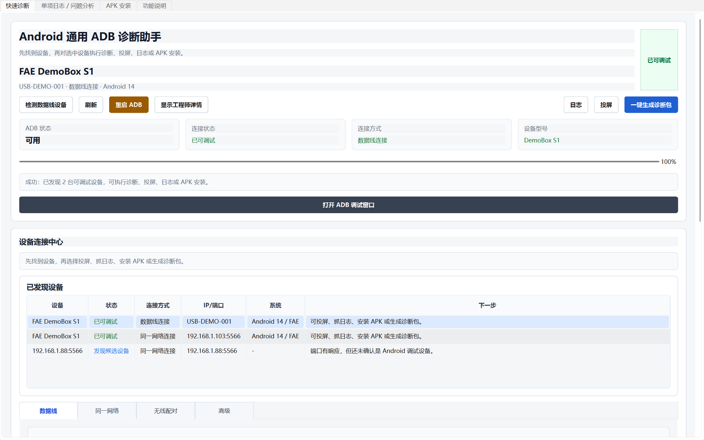
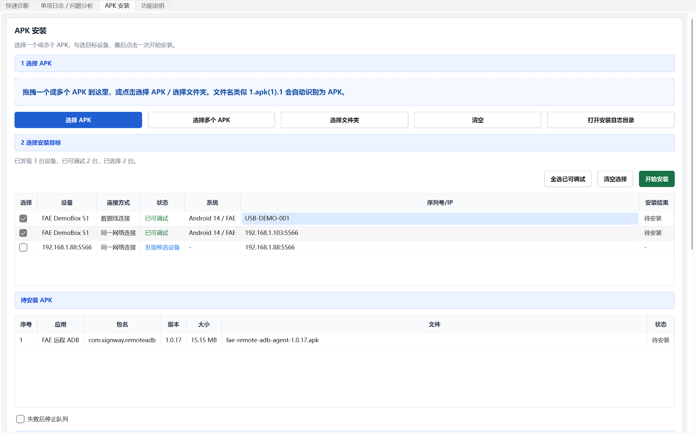

# Android 通用 ADB 诊断助手

这是一个面向普通客户和 FAE 工程师的 Windows 桌面 ADB 诊断工具。客户不需要理解命令行，只需要连接 Android 设备、点击“检测设备”，再点击“一键生成诊断包”，即可得到可发送给工程师分析的 zip 文件。

## 软件界面

> 截图使用演示设备和演示 APK，不包含真实客户设备信息。





## 主要用途

- 检测 ADB、USB 设备、网络 ADB、授权状态和基础设备信息。
- 一键抓取通用 Android 日志、系统状态、网络、蜂窝网络、应用进程、Crash/ANR 线索。
- 自动生成 `command_status.json`、`summary_report.html` 和最终 zip 诊断包。
- 提供设备连接中心、同一网络扫描、批量 APK 安装队列、截屏、10 秒录屏、实时 logcat、adb push、adb pull、adb root、adb remount、无线调试配对等常用 FAE 功能。
- 所有失败项会写入状态文件，单条命令失败不会中断整体诊断流程。

## 客户使用方法

1. 打开手机或 Android 设备的“开发者选项”和“USB 调试”。
2. 用 USB 线连接电脑和设备。
3. 双击运行 `Android_ADB_Diagnostic_Tool.exe`，或开发环境下运行 `python main.py`。
4. 点击“检测设备”。检测会先快速列出设备，再后台补全选中设备详情；如果提示未授权，请在设备上点击“允许 USB 调试”。
5. 点击“一键生成诊断包”，填写客户名称、联系人、问题现象和复现步骤。
6. 等待完成后，将生成的 `.zip` 文件发送给工程师。

## FAE 如何分析诊断包

诊断包目录包含：

- `00_customer_info/customer_info.txt`：客户填写的问题信息。
- `01_device_info/`：设备型号、系统属性、CPU、内存、存储、设置项。
- `02_logcat/`：main/system/events/radio/crash 等 logcat buffer。
- `03_bugreport/`：bugreport 输出。
- `04_dumpsys/`：activity、window、display、power、battery、network、package 等系统服务状态。
- `05_crash_anr/`：dropbox、ANR、tombstone 线索。
- `06_network/`：IP、路由、DNS、ping。
- `07_cellular/`：移动数据、telephony、carrier config、APN。
- `08_app_process/`：包列表、进程、top。
- `09_media/`：自动截图。
- `10_proc_system/`：proc 系统信息。
- `99_tool_runtime/`：工具自身运行日志。
- `command_status.json`：每条命令的执行状态。
- `summary_report.html`：HTML 摘要报告。

优先查看 `summary_report.html` 和 `command_status.json`，再进入对应日志目录做深入分析。

## 常见问题

- 未找到 adb：请将 `adb.exe` 放入 `tools/adb/`，或把 Android Platform Tools 加入系统 PATH。
- unauthorized：请在设备上点击“允许 USB 调试”。
- offline：请重新插拔 USB，关闭再打开 USB 调试，必要时重启 ADB 服务。
- dmesg、/data/anr、/data/tombstones 权限不足：这通常是系统权限限制，不代表工具异常。
- bugreport 超时：不影响其它基础日志分析，工具会继续生成诊断包。
- adb root 失败：量产用户版本固件通常不允许 root。
- adb remount 失败：系统分区可能只读，或设备未 root，或动态分区限制。

## 开发运行

```bat
cd Android_ADB_Diagnostic_Tool
python -m venv .venv
.venv\Scripts\pip install -r requirements.txt
.venv\Scripts\python main.py
```

## 打包 exe

```bat
cd Android_ADB_Diagnostic_Tool
build_exe.bat
```

输出路径：

```text
dist\Android_ADB_Diagnostic_Tool.exe
```

## 放入 adb.exe

将 Android Platform Tools 里的文件放入：

```text
tools\adb\adb.exe
tools\adb\AdbWinApi.dll
tools\adb\AdbWinUsbApi.dll
```

如果不放入内置 ADB，程序会自动查找系统 PATH 中的 `adb`。

## 开源许可

本项目使用 MIT License 开源。内置或随包分发的第三方工具（例如 Android Platform Tools、scrcpy）仍遵循其各自许可证。

## 扩展 commands.yaml

所有一键诊断命令都在 `app/config/commands.yaml` 中维护。命令不要写 `adb` 前缀，程序会自动拼接 adb 路径和 `-s SERIAL`。

示例：

```yaml
- category: device_info
  name: getprop
  command: shell getprop
  output: 01_device_info/getprop.txt
  timeout: 20
  optional: false
  description: 系统属性
```

字段说明：

- `category`：分类。
- `name`：命令唯一名称。
- `command`：不含 adb 前缀的命令。
- `output`：诊断包内输出路径。
- `timeout`：超时时间，单位秒。
- `optional`：失败是否不影响整体流程。
- `description`：界面进度说明。

## USB 调试开启方法

不同设备菜单名称略有差异，常见路径如下：

1. 设置 -> 关于设备 -> 连续点击“版本号”7 次，开启开发者选项。
2. 设置 -> 系统 -> 开发者选项 -> 打开 USB 调试。
3. 连接电脑后，在设备弹窗中点击“允许 USB 调试”。

## 设备连接中心与同一网络连接说明

推荐顺序：

1. 第一次使用先通过数据线连接设备，点击“检测数据线设备”。
2. 如需拔掉数据线继续调试，可点击“开启同一网络调试”。默认端口为 `5566`，可按现场设备配置修改。
3. 电脑和设备在同一网络时，可点击“扫描当前网络”，或在高级输入里填写起始 IP、结束 IP 和端口后点击“扫描指定范围”。
4. 扫描到的地址只有通过 ADB 验证后才会显示“已可调试”；端口有响应但未通过 ADB 验证时，会显示为“发现候选设备”。

USB 已连接设备时，“开启同一网络调试”会执行：

```text
adb tcpip 5566
```

然后可通过扫描或手动输入设备 IP 和端口 `5566` 连接。请确认电脑和设备在同一网络，且防火墙未阻断连接。

Android 11+ 无线调试可使用“无线调试配对”，输入配对 IP、配对端口和配对码后执行：

```text
adb pair IP:PORT PAIRING_CODE
```

配对成功后，再使用“连接指定地址”或“扫描当前网络”连接设备。

## 截屏和录屏

- 截屏优先使用 `adb exec-out screencap -p`，失败后自动尝试设备端截图再 pull。
- 截图保存在 `output/screenshots/`。
- 录屏使用 `adb shell screenrecord /sdcard/fae_screen.mp4 --time-limit 10`。
- 录屏保存在 `output/screenrecords/`。

## 文件传输

- push：选择本地文件，目标路径建议 `/sdcard/Download/`。
- pull：填写设备文件或目录路径，选择本地保存目录。
- `/system`、`/vendor`、`/product`、`/data` 通常需要 `adb root` 和 `adb remount` 才能写入或读取。

## APK 安装

- 主流程：选择一个或多个 APK，勾选一台或多台“已可调试”设备，点击“开始安装”。
- 目标设备来自“快速诊断”页的设备连接中心；检测数据线设备或扫描同一网络后会自动同步到 APK 安装页。
- 所有组合都会串行执行，避免多任务同时抢占 ADB；每个 APK 和每台设备都会显示成功/失败结果。
- 可点击选择 APK、选择多个 APK、选择文件夹，或把多个 APK 文件拖拽到“APK 安装”页面。
- 待安装 APK 表格会显示应用名、包名、版本、大小、文件名和安装状态；可勾选“失败后停止队列”。
- 安装任务会生成结果日志，可点击“导出安装结果”查看。
- 文件名异常时会自动识别，例如 `1.apk(1).1`、`demo.apk.bak` 会复制为标准 `.apk` 临时文件再安装。
- 待安装状态会显示应用图标、应用名称、包名、版本、文件大小、MD5、原始路径和实际安装路径。
- 默认使用覆盖安装 `adb install -r`；FAE 可按需勾选允许降级 `-d` 和授予运行时权限 `-g`。
- 安装成功后自动删除工具生成的临时 APK 文件，不删除客户原始 APK。
- 安装失败会红色提示原因和解决建议，例如版本降级、签名不一致、存储不足、设备未授权等。

## 未连接设备时如何测试

- 运行程序后点击“检测设备”，应显示“未检测到设备”的中文提示。
- 点击“打开导出目录”，应能打开 `output/`。
- 可打开实时日志窗口并关闭，验证界面不会卡死。
- 可检查 `README.md`、`commands.yaml`、`build_exe.bat` 是否存在。

## 更新说明

### 2026-06-01

- 仓库已新增可直接运行的 Windows 程序：`Android_ADB_Diagnostic_Tool/dist/Android_ADB_Diagnostic_Tool.exe`。
- 客户可下载该 exe 后直接运行，无需安装 Python 开发环境。
- 程序已包含设备连接中心、同一网络扫描、ADB 诊断、单项日志/问题分析、ADB 调试窗口、投屏、截图、录制屏幕和一键诊断包等功能入口。
- 源码、测试用例、ADB/scrcpy 依赖和打包脚本继续保留，便于后续维护和重新打包。
